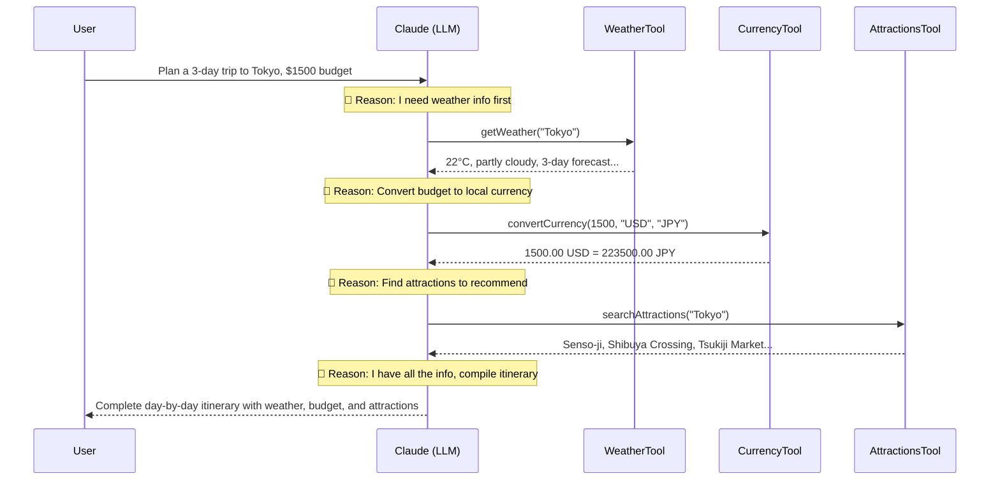
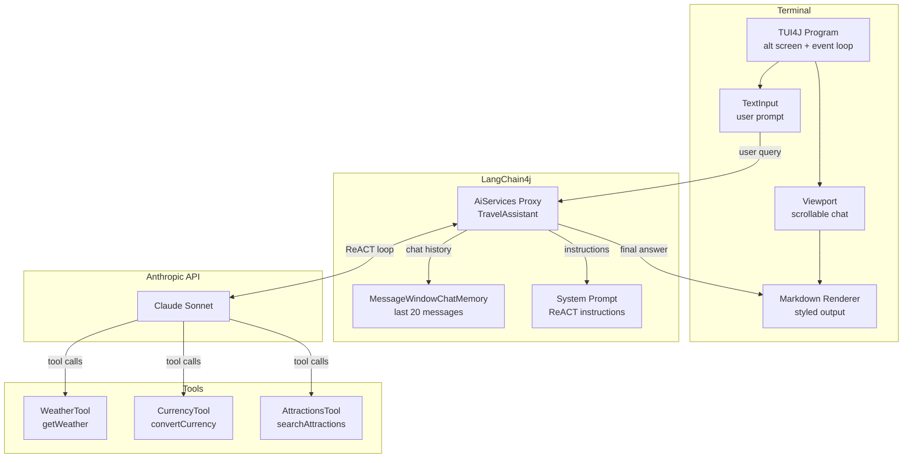

# Smart Trip Planner

A terminal-based travel planning assistant that uses the **ReACT** (Reasoning + Acting) pattern with **LangChain4j** and **Claude** to plan trips interactively. Features a rich TUI powered by **TUI4J** with scrollable chat, styled markdown rendering, and responsive layout.


## What is ReACT?

**ReACT** (Reasoning and Acting) is an LLM agent pattern where the model alternates between **thinking** about what to do and **acting** by calling tools, then **observing** the results before deciding the next step.

Unlike simple prompt-response, ReACT enables the LLM to:
- Break complex questions into steps
- Gather real information via tool calls
- Combine results from multiple sources into a coherent answer

### How ReACT Works in This App

When you ask _"Plan a 3-day trip to Tokyo on a $1500 budget"_, the agent doesn't just generate text. It **reasons** about what information it needs, **acts** by calling tools, and **observes** the results:



Each **Reason → Act → Observe** cycle is one step. LangChain4j orchestrates the loop automatically — the LLM decides which tool to call next based on the system prompt and prior observations.

## Architecture



### Component Breakdown

| Component | Role |
|---|---|
| `Main.kt` | Wires up Claude model, tools, chat memory, and starts the TUI |
| `TravelAssistant.kt` | LangChain4j `@SystemMessage` interface — the ReACT prompt that instructs the LLM to use tools step-by-step |
| `TravelApp.kt` | TUI4J `Model` — handles input, viewport scrolling, and renders styled markdown output |
| `WeatherTool.kt` | `@Tool` — returns current weather + 3-day forecast for a city |
| `CurrencyTool.kt` | `@Tool` — converts amounts between USD, EUR, GBP, JPY, THB, MXN |
| `AttractionsTool.kt` | `@Tool` — returns top 5 tourist attractions for a city |

### The ReACT System Prompt

The key to ReACT is the system prompt in `TravelAssistant.kt`:

```kotlin
@SystemMessage("""
    You are a smart travel planning assistant. When a user asks about a trip,
    you MUST use your tools step by step to gather information before answering:

    1. First check the weather at the destination using getWeather
    2. Then convert the budget to local currency using convertCurrency
    3. Then search for attractions using searchAttractions

    Always use ALL available tools to provide the most helpful answer.
    After gathering information from tools, compile a clear, well-structured itinerary.
""")
fun chat(userMessage: String): String
```

This tells the LLM **how** to reason: check weather first, then convert currency, then find attractions. LangChain4j handles the loop — it sends the prompt to Claude, intercepts tool-call responses, executes the matching `@Tool` methods, feeds results back, and repeats until the LLM produces a final text answer.

## TUI Features

The terminal UI renders LLM markdown output with rich styling:

| Markdown | Rendered As |
|---|---|
| `# Heading` | Bold pink with `━━` decorators |
| `## Heading` | Bold blue with `▸` prefix |
| `### Heading` | Bold green with `▹` prefix |
| `**bold**` | Bold text |
| `- item` / `* item` | Orange `●` bullet |
| `1. item` | Orange numbered list |
| `---` | Horizontal rule `───────` |
| `> quote` | `│` left border, italic |
| `` `code` `` | Yellow highlighted |

Other TUI features:
- Scrollable chat history (arrow keys, page up/down)
- Responsive layout — adapts to terminal resize
- User messages in cyan-bordered boxes, assistant in white-bordered boxes
- Animated spinner during LLM thinking
- Scroll percentage indicator in status bar

## Getting Started

### Prerequisites

- **Java 21+**
- **Anthropic API key**

### Run

```bash
export ANTHROPIC_API_KEY=sk-ant-...
./run.sh
```

Or with Gradle:

```bash
export ANTHROPIC_API_KEY=sk-ant-...
./gradlew run
```

### Usage

Type a travel question and press Enter:

```
Plan a 3-day trip to Tokyo on a $1500 budget
What's the weather like in Paris?
Compare London and Bangkok for a week-long trip
```

**Keyboard shortcuts:**
- `Enter` — send message
- `↑↓` — scroll chat history
- `PgUp/PgDn` — scroll by page
- `Ctrl+C` — quit

## Project Structure

```
src/main/kotlin/dev/demo/react/
├── Main.kt              # Entry point — model, tools, memory setup
├── TravelAssistant.kt   # LangChain4j AI service with ReACT system prompt
├── TravelApp.kt         # TUI4J Model — input, viewport, markdown rendering
└── tools/
    ├── WeatherTool.kt    # @Tool: city weather + 3-day forecast
    ├── CurrencyTool.kt   # @Tool: currency conversion
    └── AttractionsTool.kt # @Tool: top attractions lookup
```

## Dependencies

| Library | Version | Purpose |
|---|---|---|
| [LangChain4j](https://github.com/langchain4j/langchain4j) | 1.11.0 | AI agent framework with tool calling |
| [LangChain4j Anthropic](https://github.com/langchain4j/langchain4j) | 1.11.0 | Claude model integration |
| [TUI4J](https://github.com/williamcallahan/tui4j) | 0.3.3 | Terminal UI framework (Bubble Tea for Java) |
| Kotlin | 2.1.0 | Language |

## License

MIT
